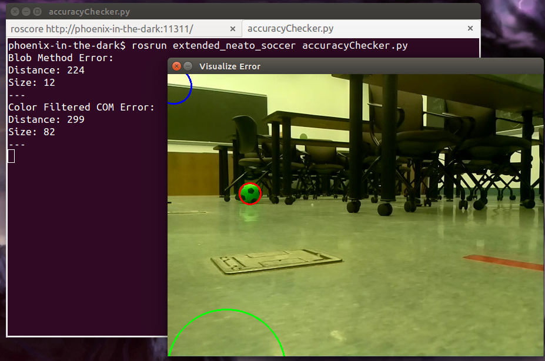

# CompRobo Final Project: Neato Soccer, Extended Edition
For this project, our ostensible goal is to program a robot (a neato vacuum cleaner) to recognize a soccer ball visually, approach it, and kick it into a goal. The real purpose is to develop our own learning goals around computer vision and object recognition via a neural network. The project is largely split along those lines.

## The Story So Far
As a part of documenting our learning during the development project, what follows are a few incremental blog posts about the paths we took as we developed the computer vision and neural network parts of the software.

### Neural Network Development

**4/18/17** - After some initial research into neural networks, we decided to start with a [multi-layered perceptron](https://en.wikipedia.org/wiki/Multilayer_perceptron) constructed using the [Lasagne package](https://github.com/Lasagne/Lasagne), closely following in the footsteps of a [blog post](http://danielnouri.org/notes/2014/12/17/using-convolutional-neural-nets-to-detect-facial-keypoints-tutorial/) by Daniel Nouri.

A multi-layered perceptron (MLP) is more or less the simplest version of a neural network. It contains many independent nodes, organized into sequential layers, that are activated or not activated by some combination of the input node values. It's not a great match for learning from images, because, by default, it lacks any concept of how an image is structured; that is, by making all of the input nodes (pixel values) independent, each has no relation to its adjacent pixels unless that relation is 'learned' by extensive training. We started here, however, because it is simple to implement.

To get the MLP running, we quickly built a system to crop, grayscale, and down-sample images to 128x128 pixel squares. We fed 20 images through this system and into the MLP. Of the images 8 contained a target object and were tagged and 12 did not contain an image and were untagged. From these twenty images, our MLP attempts to determine what differentiates a tagged image from an untagged image. Our MLP randomly selects 4 images from the set to test on after training and the results from those tests are quite poor. Almost independent of whether the target object is *actually* in the image, the MLP has about a 1/3 confidence that the image contains the object.

There are three likely reasons this is happening. The obvious one is that 20 images does not come close to approaching the size of data sets used for typical machine learning projects - common examples of starter ML projects use about 50,000 images to train on. The second likely reason is that, as described, an MLP does a poor job of understanding the 2D structure of an image. A convolutional neural network - a variant that does account for 2D structure - may do a better job and require less training to achieve reasonable results. A third possible reason is simply that our MLP is structured poorly. At present, the 128x128 input pixel values are fed into 100 hidden nodes, and then to 1 output node. That structure is a wild guess and we'll need to do more research, test other structures, or ask for help to determine what a reasonable MLP structure for this project is.

Next, we'll be trying to address the first problem - the lack of sufficient training images - by building a system to rapidly capture and tag images from our robot's camera. That should allow us to get into the thousands of tagged ball and non-ball images that will allow us to better determine whether using an MLP is a tenable solution to object recognition, or if we need a more advanced model.

**4/24/17** - To further train the neural network, we've just completed a classification program, affectionately named "Ball Tinder" after the popular Tinder phone application. In Tinder, one swipes right or left to accept or deny requests to be put contacted by another person. In Ball Tinder, the user, shown a video feed from the robot, holds the right or left arrow key in order to classify the incoming frames as containing or not-containing a ball. In this way, we can rapidly classify and format hundreds of images, taken from the robot's perspective and in the classroom context in which the robot will operate.

Ball Tinder fills an important role because it is our pipeline for getting the hundreds of images of the ball, in its context in the classroom, that will allow the neural-net to be robustly trained for its environment. One of the odd quirks of implementation is the use of the pygame library to show the current (cropped) frame, take user input, and display feedback to the user inputs. While it seems odd to have pygame in a neural network application, pygame had the simplest interface for all of the functionality we wanted Ball Tinder to provide.

While developing Ball Tinder, we've also been trying modifications to the neural network architecture. While still using only about 20 training images, we found that decreasing the input image size from 128x128 to 32x32, and increasing the number of hidden layers from 1 to 3 skyrocketed our ability to classify images from virtually non existent to relatively high confidence values of about 85% for target images and 10% for non-target images. While these values hold little relevance to the what our final, trained model will produce, the modifications to the model do imply that we have found a much more fertile model configuration for our data. If this configuration is able to provide similar accuracies when trained on the ball images, we may not need to modify the model to a convolutional neural network.

### Visual Suite Development

**4/18/17** - The intent of the visual suite is to provide multiple methods of locating and sizing a foam soccer ball with in a image taken by the Neato robot platform. In order to quantify and understand the accuracy of methods to be implemented in the visual suite, a simple script was created to both display the output of those methods against the input image as well as calculate the discrepancy between the methods' outputs and the actual location of the ball.

This script, [accuracyChecker.py](scripts/accuracyChecker.py), contains a class of the same name which requires the name of the image file to be tested against as well as the name of the file that contains the images label. The path to the directory containing these two files is assumed to be identical and is also passed in to the class when it is initialized. The label file, [locator_labels.yaml](images/locator_labels.yaml), contains the sizes and x,y-location of the soccer ball in each of the test images. The label takes the form of 

`##_neatoSoccer.png:` 
&nbsp;&nbsp;`location: [x,y]`  
&nbsp;&nbsp;`size: int`

where ## is replaced with the image's sequence number, x and y are replaced by the x,y pixel location of the ball's center in the image, and int is replaced by the diameter of the ball within the image. These labels were created via trial and error until visually correct when drawn in circle form on the original test images. 

The accuracyChecker script passes the test image to each method in the visual suite and records the returns.  Static return placeholder code is currently in place in each of visual suite locater methods to confirm the accuracy code was functioning correctly. They return information in the form of *(x,y),size*, where x,y,size are all integers. The accuracy script then calculates the Pythagorean distance between the label's x,y-location and the visual suite method's x,y-location as well as the absolute error in size between the label's size and the visual suite method's size. In addition to calculating the accuracy of the visual suite's methods, they are also visualized using openCV's circle function. 

 

Here is shown the current call and output of the accuracyChecker.py script. In red is the label. The green and blue circles are the results of the visual suite methods. Note also the readout in the terminal of the quantitative accuracy of the two visual suite methods.  

